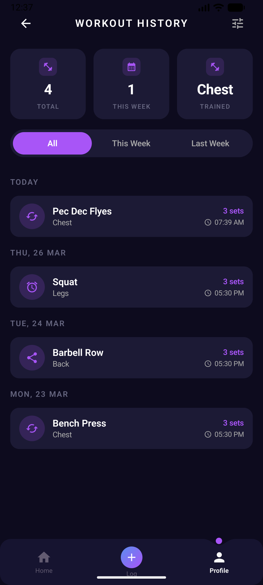

# VoluMetric

A modern Android workout tracker built with Jetpack Compose that helps you log exercises and monitor weekly training volume by muscle group.

## Why I Built This

I built VoluMetric to scratch my own itch. As someone who trains seriously, I wanted to track **weekly training volume per muscle group** — sets done vs. a target — so I could spot under- or over-trained areas at a glance. After trying every popular fitness app on the Play Store, I couldn't find one that made this simple. Most apps focus on logging individual workouts or 1-rep maxes, not on weekly volume balance across muscle groups. So I built the app I actually wanted to use.

## Screenshots

<p align="center">
  
  &nbsp;&nbsp;
  
  &nbsp;&nbsp;
  
</p>

## Features

- **Home Dashboard** — Weekly goal card with sets completed and average training intensity, plus a per-muscle-group progress grid
- **Workout Logging** — Pick a muscle group, name the exercise, log total sets — saved instantly to the local database
- **Workout History** — Filter all past workouts by All / This Week / Last Week, grouped under TODAY / YESTERDAY / dated headers, with at-a-glance stats (total workouts, this week's count, most-trained muscle)
- **Weekly Volume Tracking** — Sets are automatically aggregated per muscle group on a rolling weekly basis
- **Reactive UI** — Stat cards, lists, and progress bars update instantly via Kotlin Flows whenever a workout is logged

## Tech Stack

| Layer | Library |
|-------|---------|
| UI | Jetpack Compose + Material 3 |
| Navigation | Compose Navigation + Animated Navigation Bar |
| DI | Hilt |
| Database | Room (with KSP) |
| State Management | ViewModel + Kotlin StateFlow |
| Architecture | MVVM |

## Project Structure

```
com.example.volumetric
├── data/
│   ├── database/         # Room database, DAO, entities
│   ├── mappers/          # Entity ↔ domain model mappers
│   └── di/               # Hilt modules
├── domain/
│   ├── models/           # Domain models (Muscle, WorkoutDetail, HistoryFilter, DateBucket)
│   └── viewmodel/        # ViewModels (LogWorkout, MuscleStats)
├── presentation/
│   ├── composables/      # Reusable UI components per screen
│   ├── navigation/       # Bottom navigation setup
│   └── screens/          # Home, Workout, History
└── ui/theme/             # Colors, typography, theme
```

## Getting Started

1. Clone the repository
   ```bash
   git clone https://github.com/ritesh423/VoluMetric.git
   ```
2. Open in **Android Studio** (Hedgehog or newer recommended)
3. Sync Gradle and run on an emulator or device (API 26+)

## License

This project is for personal/educational use.
