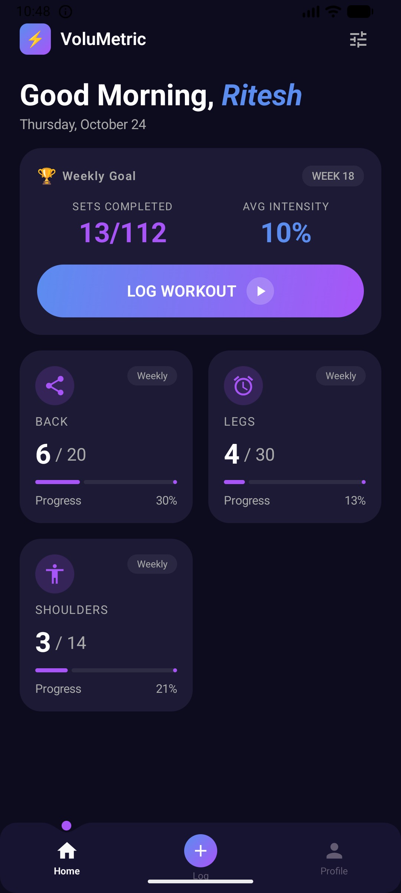
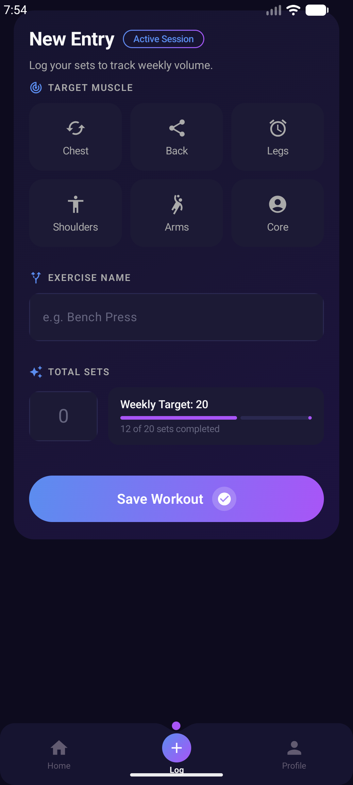

# VoluMetric

A modern Android workout tracker built with Jetpack Compose that helps you log exercises and monitor weekly training volume by muscle group.

## Screenshots

<p align="center">
  
  &nbsp;&nbsp;&nbsp;
  
</p>

## Features

- **Home Dashboard** — View weekly training stats at a glance with per-muscle-group progress cards
- **Workout Logging** — Log sets by selecting a target muscle group, entering the exercise name, and recording total sets
- **Weekly Volume Tracking** — Automatically aggregates sets per muscle group on a week-by-week basis
- **Animated Bottom Navigation** — Smooth animated nav bar with ball trajectory and indent animations

## Tech Stack

| Layer | Library |
|-------|---------|
| UI | Jetpack Compose + Material 3 |
| Navigation | Compose Navigation + Animated Navigation Bar |
| DI | Hilt |
| Database | Room (with KSP) |
| State Management | ViewModel + Kotlin StateFlow |
| Architecture | MVVM |

## Project Structure

```
com.example.volumetric
├── data/
│   ├── database/         # Room database, DAO, entities
│   └── di/               # Hilt modules 
├── domain/
│   ├── models/           # Domain models (Muscle)
│   └── viewmodel/        # ViewModels (LogWorkout, MuscleStats)
├── presentation/
│   ├── composables/      # Reusable UI components
│   ├── navigation/       # Bottom navigation setup
│   └── screens/          # App screens
└── ui/theme/             # Colors, typography, theme
```

## Getting Started

1. Clone the repository
   ```bash
   git clone https://github.com/ritesh423/VoluMetric.git
   ```
2. Open in **Android Studio** (Hedgehog or newer recommended)
3. Sync Gradle and run on an emulator or device (API 26+)

## License

This project is for personal/educational use.
