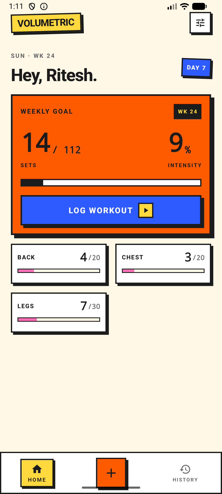
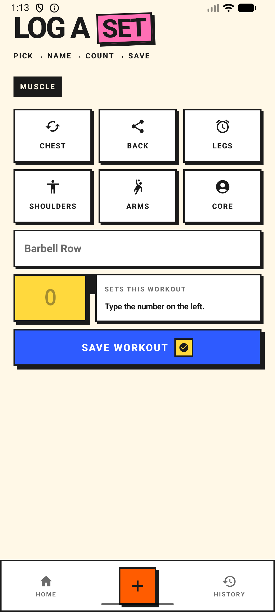
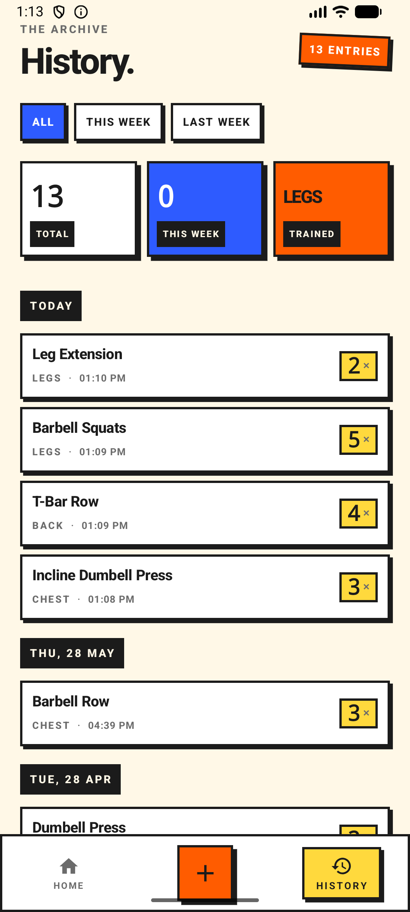

# VoluMetric

A modern Android workout tracker built with Jetpack Compose that helps you log exercises and monitor weekly training volume by muscle group — wrapped in a deliberately un-fitness-app design.

## Why this is different

Open the Play Store fitness category and almost every app looks the same: dark navy backgrounds, purple/blue gradients, neon green accents. VoluMetric goes the other way.

The whole UI is built in a **brutalist / Y2K poster** style — cream paper backgrounds, thick black borders, hard offset shadows (no blur), flat poster colors (orange, electric blue, sunflower yellow, pink), and chunky display type. Cards look like stickers slapped on paper. Numbers are oversized and monospace. Stat blocks rotate slightly off-axis. Active tabs get yellow sticker chips. The "Save" button springs in, presses down on tap, and lands with a satisfying shadow.

It scratches the same itch as any other tracker — **weekly volume per muscle group, sets done vs. target** — but it doesn't feel like another templated dashboard.

## Screenshots

<p align="center">
  
  &nbsp;&nbsp;
  
  &nbsp;&nbsp;
  
</p>

## Why I built it

As someone who trains seriously, I wanted to track weekly training volume per muscle group — sets done vs. a target — so I could spot under- or over-trained areas at a glance. Most popular fitness apps focus on logging individual workouts or 1-rep maxes, not on weekly volume balance. So I built the app I actually wanted to use, and styled it the way I actually wanted to look at.

## Features

- **Home dashboard** — weekly goal card with sets completed and average training intensity, plus a per-muscle-group progress grid that color-codes each muscle by how on-track it is (blue / yellow / orange / pink).
- **Workout logging** — pick a muscle group, name the exercise, tap in your set count. Saved instantly to a local Room database.
- **Workout history** — filter past workouts by *All / This Week / Last Week*, grouped under *TODAY / YESTERDAY / dated* headers, with at-a-glance stats (total workouts, this week's count, most-trained muscle).
- **Reactive UI** — stat cards, lists, and progress bars update instantly via Kotlin Flows whenever a workout is logged.
- **Spring entry + press animations** — every card bounces in on first composition; chips and buttons scale on press for tactile feedback.

## Design system

The brutalist look comes from four files under `ui/theme/`:

- `Color.kt` — 9 flat poster colors. No gradients.
- `Type.kt` — sans-serif display + monospace numbers, all caps for labels.
- `Theme.kt` — Material 3 light scheme + dark status-bar icons.
- `BrutalistModifiers.kt` — three reusable building blocks: `brutalistShadow()` (hard offset shadow), `brutalistEntry()` (spring-in animation), `pressScale()` (tap feedback).

Every card in the app is just `brutalistShadow + background + border` plus one of these animation hooks.

## Tech Stack

| Layer | Library |
|-------|---------|
| UI | Jetpack Compose + Material 3 |
| Navigation | Custom brutalist bottom bar |
| DI | Hilt |
| Database | Room (with KSP) |
| State | ViewModel + Kotlin StateFlow |
| Architecture | MVVM |

## Project Structure

```
com.example.volumetric
├── data/
│   ├── (database/)       # Room database, DAO, entities
│   └── mappers/          # Entity ↔ domain model mappers
├── domain/
│   ├── models/           # Muscle, WorkoutDetail, HistoryFilter, DateBucket
│   ├── repository/       # WorkoutRepository
│   └── viewmodel/        # LogWorkout, MuscleStats
├── presentation/
│   ├── composables/      # Reusable UI components per screen (home/, workout/, history/)
│   ├── navigation/       # Bottom navigation
│   └── screens/          # HomeScreen, WorkoutScreen, HistoryScreen
└── ui/theme/             # Brutalist color, type, theme, modifiers
```

## Getting Started

1. Clone the repository
   ```bash
   git clone https://github.com/ritesh423/VoluMetric.git
   ```
2. Open in **Android Studio** (Hedgehog or newer)
3. Sync Gradle and run on an emulator or device (API 26+)

## License

For personal/educational use.
